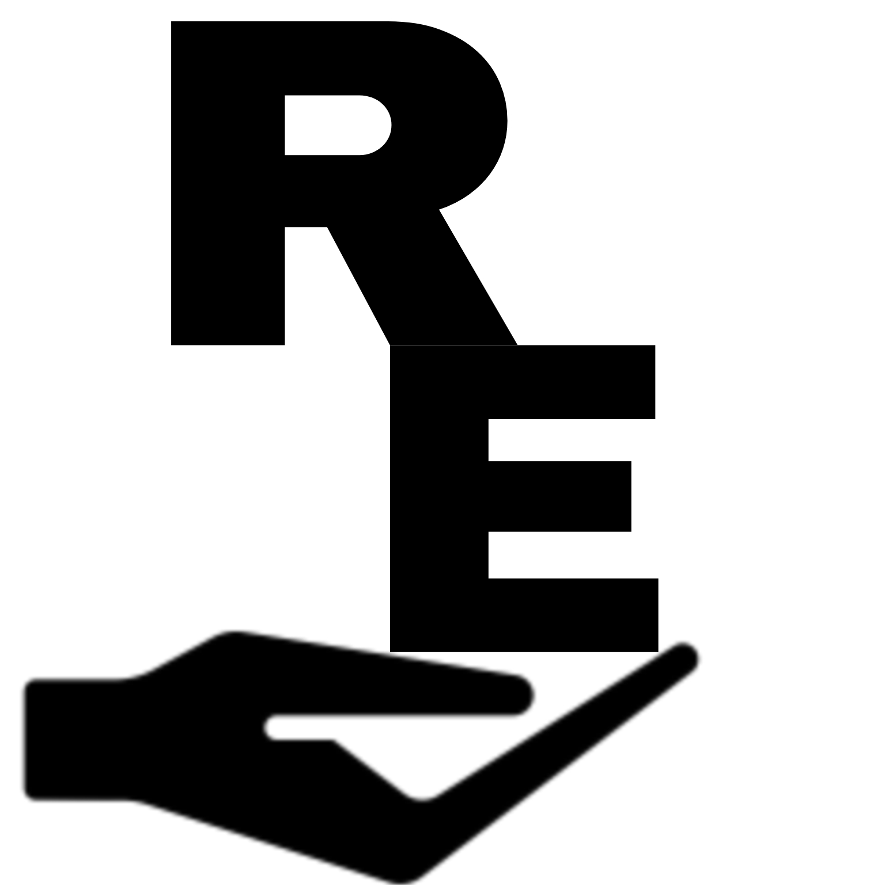

# FinalProjectWebsite

Sources 

Template for Website
https://www.free-css.com/free-css-templates/page289/seotech

Singular Icon
https://www.flaticon.com/search?type=icon&word=computer+logo

URL for the Non copyrighted Avatars used for Icons.
<a href="https://www.freepik.com/free-vector/multiracial-people-avatars_7085153.htm#query=avatar&position=0&from_view=keyword&track=sph">Image by pikisuperstar</a> on Freepik

Icons for the website.
https://fontawesome.com/

Non-copyrighted images websites for the website.
https://www.pexels.com/

https://pixabay.com/

HTML CODE CHANGES

There are about 24 image additions or changes to his website. 
Theres 6 icon changes with the website. 

Changes between the About and Service HTML files are the same as the Index.html files. 
The about and service files are used for that you can tab to different sections of the website. 

The addition of the </img> command in the  section of the website. (Was added to show the logo of the website.) 

  Rogers Electronics
  

The entire Hero_Area div and slider_section class was changed. The background image was changed in that section. There were changes to the text and images used in that class. 

